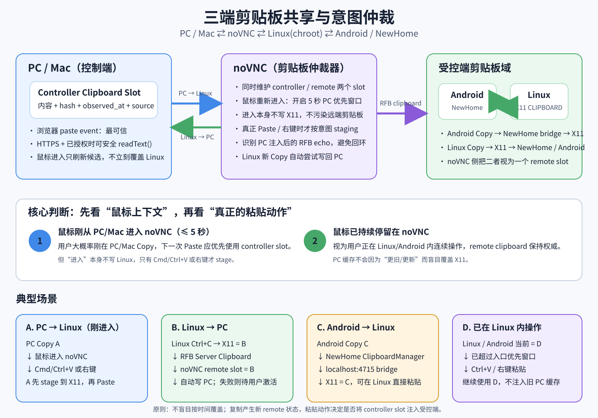

# NewHome 三端剪贴板仲裁



## 目标

NewHome 的远程桌面实际有三个剪贴板来源：

1. **控制端 PC / Mac**：浏览器所在系统剪贴板。
2. **Android / NewHome**：Android 系统剪贴板，由 NewHome 现有输入法 `ClipboardManager` 维护。
3. **Linux / chroot**：X11 `CLIPBOARD`。

Android 与 Linux 位于同一台设备，现有 NewHome bridge 已经让二者实时收敛，因此在 noVNC 侧把它们视为同一个 **remote clipboard domain**。noVNC 不再做“谁最后更新谁覆盖”的简单镜像，而是维护两个逻辑槽位：

- `controller slot`：最后可靠观察到的 PC/Mac 剪贴板。
- `remote slot`：最后从 Linux/Android 经 RFB 返回的剪贴板。

复制和粘贴的用户意图再决定何时把一个槽位送到另一侧。

## PC/Mac ↔ Linux 的文本传输只走 RFB

PC/Mac 与 Linux 之间不再通过 `/newhome-clipboard`、NewHome 4715 或额外 HTTP 接口绕行。noVNC 的 VNC 文本剪贴板本身就是唯一传输路径：

- **Browser → Linux**：经典 `ClientCutText` 直接发送 UTF-8 bytes；Extended Clipboard 继续使用协议已有的 UTF-8 编码。
- **Linux → Browser**：x11vnc 常把 UTF-8 bytes 塞进经典 `ServerCutText` 的历史 8-bit 字段，noVNC 在写浏览器系统剪贴板前把这种 byte-string 按严格 UTF-8 恢复。
- 如果经典 `ServerCutText` 的 bytes 不是合法 UTF-8，则保持原来的 Latin-1/RFB 文本，不做破坏性转换。
- Extended Clipboard 已经完成 UTF-8 解码，不进行第二次解码。

这层兼容只发生在 noVNC/RFB 边界，不再 hook x11vnc 的 `XConvertSelection`、`XChangeProperty` 或 X11 clipboard state machine。

NewHome 4715 仍可继续负责**同一设备内部 Android ↔ Linux/X11** 的同步，但它不参与浏览器 ↔ Linux 的 VNC 文本传输。

## 核心规则

### 1. 鼠标进入 noVNC：只改变优先级，不立即覆盖

鼠标从 PC/Mac 桌面重新进入 noVNC 画布时，开启一个短暂的 **controller priority window**（当前 5 秒）。

进入本身只意味着“用户可能刚在 PC/Mac 复制了内容”，不能证明他一定要粘贴，因此：

- 尝试在浏览器已经允许 Async Clipboard 的情况下刷新 `controller slot`；
- **不立即改写 X11 clipboard**；
- Firefox/Safari 如果不能无提示读取，则不调用会弹出浏览器原生 `Paste` 菜单的读取路径。

### 2. 刚进入后 Cmd/Ctrl+V：优先 PC/Mac

浏览器给出真实 `paste` event 时，`event.clipboardData` 是最强证据：

1. 更新 `controller slot`；
2. 通过 RFB `ClientCutText` / Extended Clipboard 把文本写入 Linux；
3. 再向 Linux 发送 Ctrl+V。

如果浏览器没有给出 paste event，则只有在 5 秒入口窗口内才使用已缓存的 `controller slot`；超过窗口后直接发送 Linux Ctrl+V，不碰当前 remote clipboard。

### 3. 刚进入后右键：准备 PC/Mac clipboard，再让 Linux 自己显示菜单

普通右键必须仍然是 Linux 的右键。

在入口窗口内，右键 `pointerdown` 会先把已知的 `controller slot` 通过 RFB stage 到远端 X11，然后原始右键继续发送给 Linux。用户随后在 Linux 原生菜单中点“粘贴”时，使用的就是 PC/Mac 内容。

noVNC 自己的浏览器 context menu 被抑制，并且不会在 `contextmenu` 中调用 `navigator.clipboard.readText()`，因此不会再出现 Firefox/Safari 那个突兀的浏览器“粘贴”授权菜单。

### 4. 已经持续在 Linux 内操作：remote clipboard 优先

一旦入口窗口过去，就认为当前工作上下文已经切到 Linux/Android：

- Linux 内 Ctrl+V 使用现有 X11 clipboard；
- 不因为 PC/Mac 有一份旧缓存就覆盖 X11；
- Android 复制会通过 NewHome bridge 更新 X11；
- Linux 复制会通过 NewHome bridge 更新 Android。

### 5. Linux / Android Copy：主动回写控制端

RFB 收到新的 server clipboard 时：

1. 对经典 ServerCutText 做严格 UTF-8 byte-string 恢复，失败则保留原文；
2. 更新 `remote slot`；
3. 尝试 `navigator.clipboard.writeText()` 写到 PC/Mac；
4. 如果浏览器要求新的 user activation，则保留为 pending，在下一次可信点击时重试。

如果服务器返回的内容与 noVNC 几秒内刚从 `controller slot` 注入的内容相同，则视作 echo/ack，不当作新的 Linux Copy，也不进行无意义的反向覆盖。

## 三端状态关系

```text
PC / Mac system clipboard
        │
        │ browser paste / permission-safe read
        ▼
┌─────────────────────┐
│ noVNC controller    │
│ clipboard slot      │
└─────────────────────┘
        │
        │ intent-aware RFB ClientCutText / Extended Clipboard
        ▼
┌─────────────────────┐
│ X11 CLIPBOARD       │◄──────────────┐
│ Linux / chroot      │               │
└─────────────────────┘               │
        │                             │
        │ NewHome bridge :4715        │
        ▼                             │
┌─────────────────────┐               │
│ Android/NewHome     │───────────────┘
│ system clipboard    │
└─────────────────────┘
```

Android/NewHome 与 X11 的同步仍以现有 NewHome 输入法 `ClipboardManager` 为 Android 唯一事实源，不建立第二套 Android clipboard listener/history。

## Linux bridge 可观测状态

`sh/termux/chroot/newhome_clipboard_bridge.py` 会写：

```text
/tmp/newhome-clipboard-state.json
```

内容包括：

- `generation`
- `origin` (`android` / `x11`)
- `direction`
- `sha256`
- 字符数和短 preview
- 是否仍在等待同步
- NewHome 4715 是否连接

这里故意把 Linux 侧来源写成 `x11`，而不是武断地写成 `linux`：x11vnc 从 PC 注入的 clipboard 也会表现为 X11 变化。以后如果加入 XFixes selection-owner 监听，可以进一步区分“Linux 应用 Copy”和“x11vnc 注入”，同时让现有 XFCE 托盘直接读取这个状态文件显示来源和同步状态。

## 当前边界

浏览器安全策略仍然是最硬的边界：网页不能在所有浏览器中无条件、无提示读取系统剪贴板。当前实现因此遵循：

- 能安全读取就提前刷新 PC/Mac slot；
- 真实 paste event 永远可信；
- 不能安全读取时不制造浏览器原生 Paste 弹窗；
- 不确定时保护 Linux/Android 当前 clipboard，而不是盲目覆盖。
